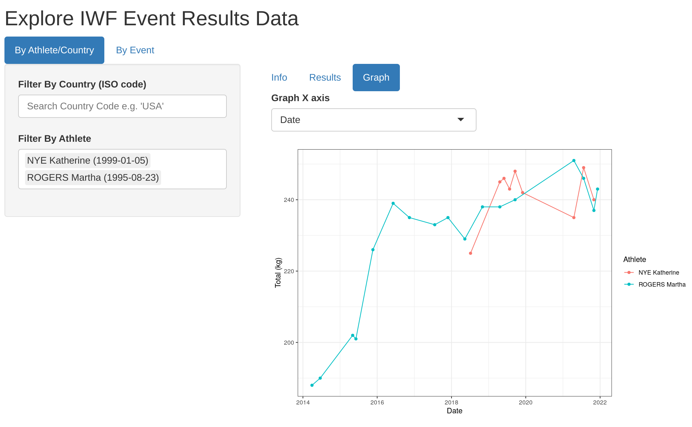
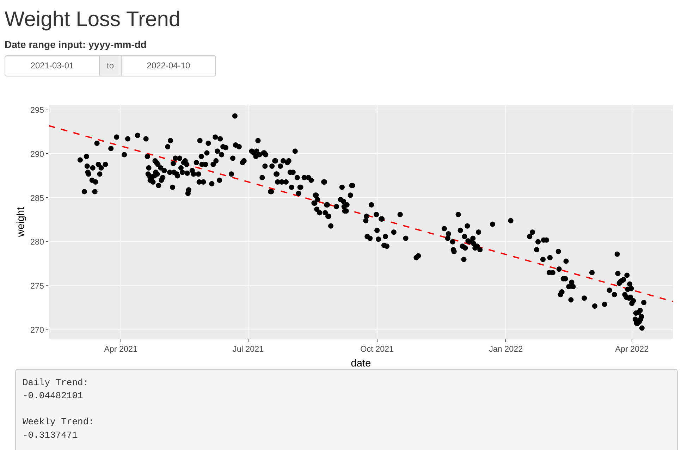
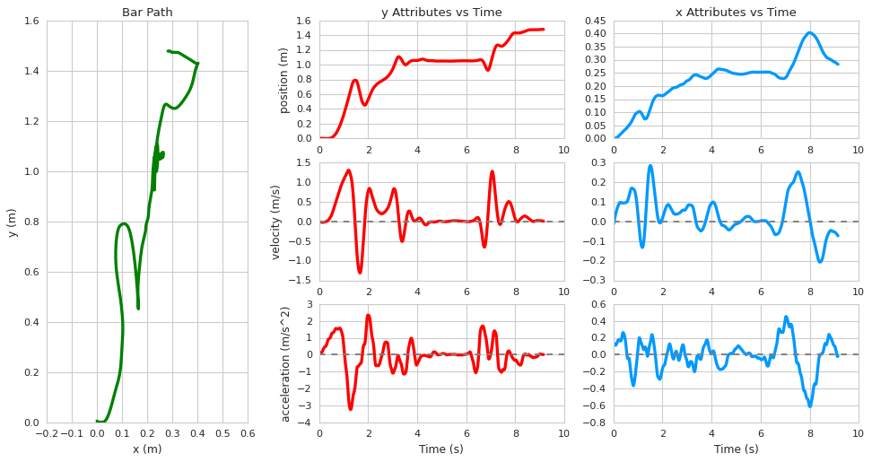
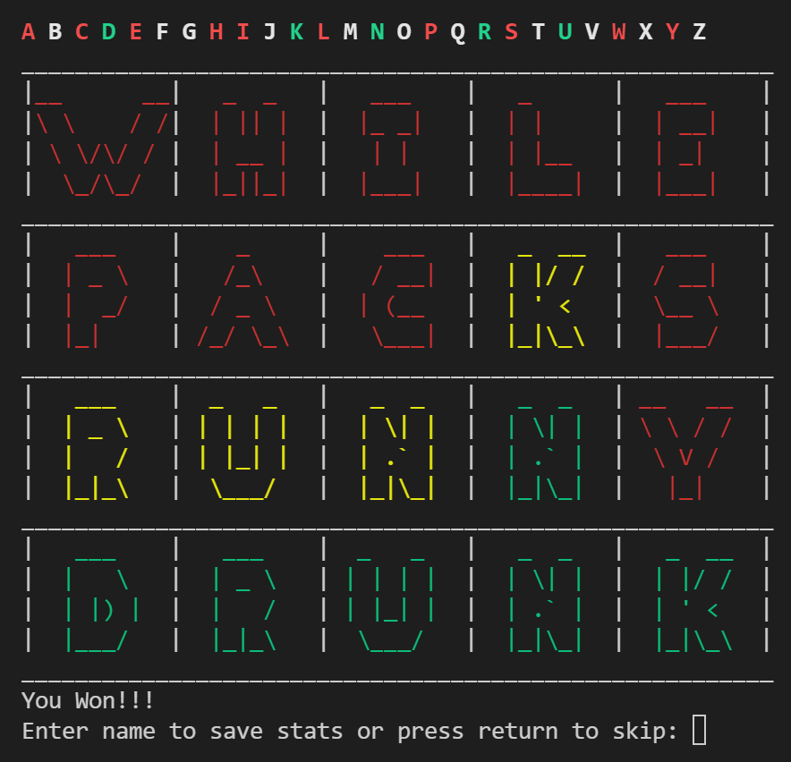
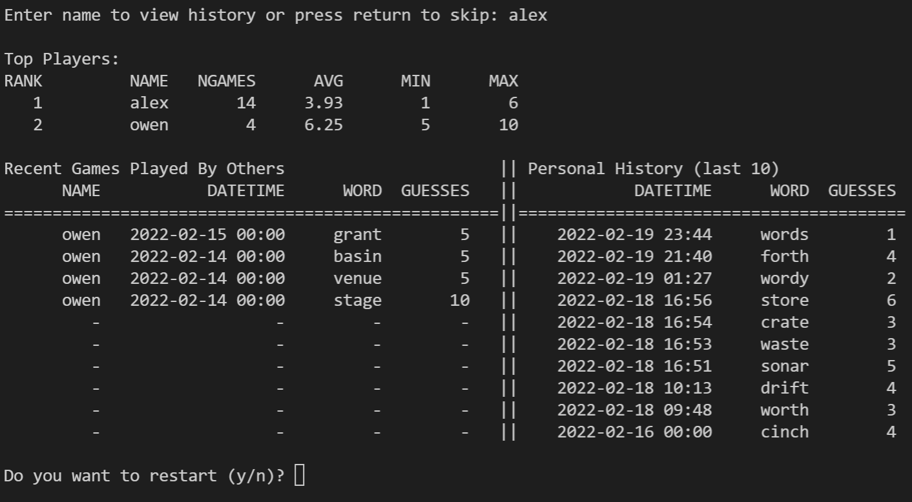
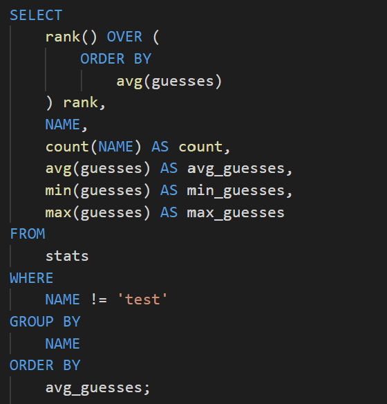
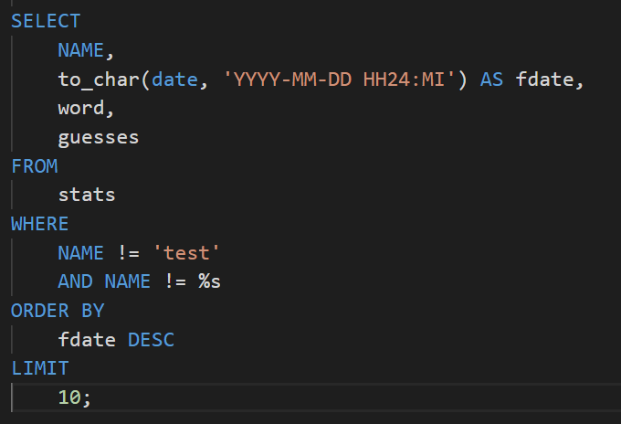

**Welcome to my portfolio**  
Below is a list of school and personal projects. Each has a description and links to a final report, source code, or a notebook.

**Table of Contents:**
- [**Personal Projects**](#personal-projects)
  - [**Data Collection and Cleaning**](#data-collection-and-cleaning)
    - [*Scraping the IWF Website for Event Results And Athlete Data*](#scraping-the-iwf-website-for-event-results-and-athlete-data)
  - [**Dashboards**](#dashboards)
    - [*Weightlifting Results Dashboard*](#weightlifting-results-dashboard)
    - [*Weightloss Tracking Dashboard*](#weightloss-tracking-dashboard)
  - [**Machine Learning**](#machine-learning)
    - [*Disaster Tweet Classification in R Using a linear SVM model*](#disaster-tweet-classification-in-r-using-a-linear-svm-model)
    - [*Predicting Survivors of the Titanic in Python*](#predicting-survivors-of-the-titanic-in-python)
    - [*Barbell Tracking for Performance Metrics Using Deep learning*](#barbell-tracking-for-performance-metrics-using-deep-learning)
  - [**SQL and General Programming**](#sql-and-general-programming)
    - [*Recreating Wordle in Python with a SQL Database for Scores*](#recreating-wordle-in-python-with-a-sql-database-for-scores)
- [**Past School Projects**](#past-school-projects)
  - [**Visualization**](#visualization)
    - [*Visualization and Exploration of the Gapminder Dataset Using ggplot/tidyverse Packages in R*](#visualization-and-exploration-of-the-gapminder-dataset-using-ggplottidyverse-packages-in-r)
  - [**Time Series Analysis**](#time-series-analysis)
    - [*Analysis of Homicides in the US Over Time Using R and an ARMA/SARIMA Model*](#analysis-of-homicides-in-the-us-over-time-using-r-and-an-armasarima-model)
  - [**Regression Analysis**](#regression-analysis)
    - [*Reproducing the Results and Logistic Regression Model of a study on Modeling Prison Sentencing From Facial Features*](#reproducing-the-results-and-logistic-regression-model-of-a-study-on-modeling-prison-sentencing-from-facial-features)
  - [**Machine Learning**](#machine-learning-1)
    - [*Predicting Ebay Car Prices Using a Random Forest Model in R*](#predicting-ebay-car-prices-using-a-random-forest-model-in-r)
    - [*Fitting a Bayesian Hierarchical Model on Fake Flu Data. Simulated with an MCMC algorithm using R and Rjags/jags.*](#fitting-a-bayesian-hierarchical-model-on-fake-flu-data-simulated-with-an-mcmc-algorithm-using-r-and-rjagsjags)

  

# **Personal Projects**

## **Data Collection and Cleaning**

### *Scraping the IWF Website for Event Results And Athlete Data*

The repository is [github.com/cluffa/IWF_data](https://github.com/cluffa/IWF_data). I scraped many pages for all event results and athlete stats from the International Weightlifting Federation's website. I used python for scraping. I needed the data to be easily imported into R, so I used R to clean and save the data.

I am currently exploring the data and working on an analysis. It will cover some topics such as competition strategy, comparison of countries and athletes, and predicting PED use.

Work in progress analysis [here](https://cluffa.github.io/IWF_data/).

## **Dashboards**

Dashboards are running [here](http://alex-server.rcluff.com:3838) and the source code is at [github.com/cluffa/MyShinyServer](https://github.com/cluffa/MyShinyServer)

I have a dashboard for easily filtering IWF event results and graphing athlete comparisons. There is also a dashboard I use for tracking weight loss trends with a linear regression model. It syncs with google sheets and my smart scale.

### *Weightlifting Results Dashboard*

### *Weightloss Tracking Dashboard*

## **Machine Learning**

### *Disaster Tweet Classification in R Using a linear SVM model*  

View this project's [R Notebook](https://cluffa.github.io/disaster_tweets_nlp_svm/).  

The data is a collection of tweets that have been labeled as pertaining to a disaster or not. For example, one might be about the damage of an earthquake while another is about a sports team. Each tweet has a text body, keyword, and location. I used a linear support vector machine (SVM) model and tested the model with combinations of text body, keyword, and location.

### *Predicting Survivors of the Titanic in Python*  

View this project's [Jupyter Notebook](https://github.com/cluffa/titanic/blob/master/titanicV2.ipynb). Most of the graphing and data exploration was done in the [first version of the notebook](https://github.com/cluffa/titanic/blob/master/titanic.ipynb) where I added no features.

The main goal was to try to predict survivors based on what we know about each passenger. I used scikit-learn pipelines to make a clear transformation pipeline for the data. This includes encoding, multivariate imputing, as well as training. I used a gradient boosting classifier model where hyperparameters were optimized by grid search and cross-validation. This notebook was used to submit scores to Kaggle's "Titanic: Machine Learning From Disaster" competition. With feature engineering like multivariate imputing and matching families, I achieved an accuracy score of 0.801 when submitting. This put me in the top 5% of the leader board.

### *Barbell Tracking for Performance Metrics Using Deep learning*

Github repository: [github.com/cluffa/bar_tracking](https://github.com/cluffa/bar_tracking)

I created this model and python package to be able to track a barbell and get different metrics. It works using a convolutional neural network with 2 million parameters. This takes a 320x320x3 matrix input and outputs a segmentation of the image (aka mask). Ellipsis are fit to the largest inside and outside weight plates detected in the mask. This is a reliable way find the center, even if the object is partially out of frame. The average of the two sides is used for the metrics. This is a good way to combat some of the distortions due to off-axis movements like rotation. The plates are always a constant 450 mm, so I was able to scale the units from pixels to meters using the dimensions of the ellipsis. The position at every time is then used to create two splines, f1(t)=x and f2(t)=y. The velocity and acceleration are derived from the splines. These also go through Savgov filters remove distortions and noise.

## **SQL and General Programming**

### *Recreating Wordle in Python with a SQL Database for Scores*

Github repository: [github.com/cluffa/wordpy](https://github.com/cluffa/wordpy)

| Game      | Game History/Leader board |
| ----------- | ----------- |
|   |  |  

**Some of the queries:**  

| Logging | Rankings | Personal Game History |
| ----------- | ----------- | ----------- |
|  |  |  |  

This was a fun side project where my goal was to recreate wordle and use a SQL database for leader boards. I was able to further my understanding of databases and postgreSQL by using elephantSQL to host a table of the scores. Every time a game is completed, a log is added to the database with a name, date, word, number of guesses, and some other metrics. Then a query is executed to display basic stats and game history.

  

# **Past School Projects**

## **Visualization**

### *Visualization and Exploration of the Gapminder Dataset Using ggplot/tidyverse Packages in R*

View this project's [final report](https://github.com/cluffa/stat5730project/blob/master/final_report_Alex_Cluff.pdf) and [source code](https://github.com/cluffa/stat5730project/blob/master/final_report_Alex_Cluff.Rmd).  

  

The focus of this project was to explore the famous Gapminder dataset visually using ggplot graphs like the one above. I also used the other tidyverse packages like dplyr to manipulate the data in different ways to create well formatted data that fits into summary tables.

## **Time Series Analysis**

### *Analysis of Homicides in the US Over Time Using R and an ARMA/SARIMA Model*

View this project's [final report](https://cluffa.github.io/stat5550project/) and [source code](https://github.com/cluffa/stat5550project/blob/master/final_project_Alex_Cluff.Rmd).  
  

This project was based around forecasting methods. I find overall trends, monthly seasonality, and fit ARIMA and SARIMA models. I compare the two model's performance as well as fit. I then forecasted homicides for the next 24 months.

## **Regression Analysis**

### *Reproducing the Results and Logistic Regression Model of a study on Modeling Prison Sentencing From Facial Features*

View this project's [final report](https://github.com/cluffa/stat3302project/blob/main/group_project.pdf) and [source code](https://github.com/cluffa/stat3302project/blob/main/model.R).  

  

The idea for this assignment was to gain experience and become more comfortable reading and interpreting scientific research papers. We also learned the importance of reproducibility and transparency. My group was tasked with reproducing the results and models from this paper and reporting on them. I was in charge of the modeling as well as the table for the models, both of which are created with the source code I linked. The picture above is a replication of the table used in the original paper. Interestingly, we ended up finding a small mistake in the paper.

## **Machine Learning**

### *Predicting Ebay Car Prices Using a Random Forest Model in R*

View this project's [final report](https://github.com/cluffa/stat4620project/blob/master/final_report_made_in_colaboration_with_classmates.pdf), [source code for the random forest model](https://github.com/cluffa/stat4620project/blob/master/randomForest.R), and [source code for cleaning the data](https://github.com/cluffa/stat4620project/blob/master/clean_autos_dataset.R).  

This was a group project. I handled the random forest model as well as the data cleaning. We each tried a model and compared results. The random forest model came out on top based on testing MSE. I had to learn a lot about resource allocation to complete this project. The dataset had 180k rows and 10+ possible predictors. I quickly found out that I would not be able to easily tune and train the model. The training process ended up taking a few days with cross-validation on less than half of the full dataset. I had to weigh run time vs accuracy and pick model parameters early on in the training process.

### *Fitting a Bayesian Hierarchical Model on Fake Flu Data. Simulated with an MCMC algorithm using R and Rjags/jags.*

View this project's [final report](https://github.com/cluffa/stat3303project/blob/master/Final_project_Alex_Cluff.pdf), [report source code](https://github.com/cluffa/stat3303project/blob/master/Final_project_Alex_Cluff.Rmd), and [model fitting source code](https://github.com/cluffa/stat3303project/blob/master/fit.R)  

The setup for this project:  
"There are two tests for influenza strain K9C9. The data collected consists of 10 countries and 100 pairs of
test results. The more accurate of the tests will be assumed fact. The less accurate test, EZK, is the area of
interest for this project. A Bayesian hierarchical model will be fit and it will be simulated with an MCMC
algorithm using R/jags."  
I fit the model, assessed fit, and interpreted the results in the context of a global pandemic.
