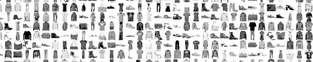
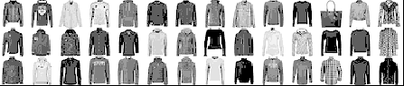
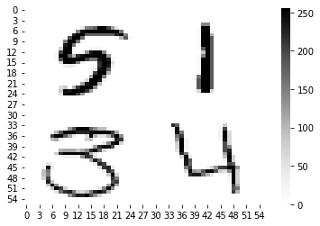

# **Portfolio**

Welcome to my portfolio. Below is a list of school and personal projects. Each has a description and links to a final report and source code or a notebook.

## **Contents**

- [**Portfolio**](#portfolio)
- [**Personal Projects**](#personal-projects)
  - [**Data Collection and Cleaning**](#data-collection-and-cleaning)
    - [- *Scraping the IWF Website for Event Results And Athlete Data*](#--scraping-the-iwf-website-for-event-results-and-athlete-data)
  - [**Machine Learning**](#machine-learning)
    - [- *Classification of Tweets as Being the Result of a Disaster in R Using a Stacked Random Forest - Logistic Regression Model*](#--classification-of-tweets-as-being-the-result-of-a-disaster-in-r-using-a-stacked-random-forest---logistic-regression-model)
    - [- *K-means Image Clustering in R*](#--k-means-image-clustering-in-r)
    - [- *Predicting Survivors of the Titanic in Python Using Scikit-learn.*](#--predicting-survivors-of-the-titanic-in-python-using-scikit-learn)
    - [- *Recognizing Digit in the MINST dataset with a Convolutional Neural Network using TensorFlow, Keras, and Python*](#--recognizing-digit-in-the-minst-dataset-with-a-convolutional-neural-network-using-tensorflow-keras-and-python)
- [**Past School Projects**](#past-school-projects)
  - [**Visualization**](#visualization)
    - [- *Visualization of the Gapminder Dataset Using ggplot/tidyverse Packages in R*](#--visualization-of-the-gapminder-dataset-using-ggplottidyverse-packages-in-r)
  - [**Time Series Analysis**](#time-series-analysis)
    - [- *Analysis of Homicides in the US Over Time Using R and an ARMA/SARIMA Model*](#--analysis-of-homicides-in-the-us-over-time-using-r-and-an-armasarima-model)
  - [**Regression Analysis**](#regression-analysis)
    - [- *Reproducing the Results and Logistic Regression Model of a study on Modeling Prison Sentencing From Facial Features*](#--reproducing-the-results-and-logistic-regression-model-of-a-study-on-modeling-prison-sentencing-from-facial-features)
  - [**Machine Learning**](#machine-learning-1)
    - [- *Predicting Ebay Car Prices Using a Random Forest Model in R*](#--predicting-ebay-car-prices-using-a-random-forest-model-in-r)
    - [- *Fitting a Bayesian Hierarchical Model on Fake Flu Data. Simulated with an MCMC algorithm using R and Rjags/jags.*](#--fitting-a-bayesian-hierarchical-model-on-fake-flu-data-simulated-with-an-mcmc-algorithm-using-r-and-rjagsjags)

<br /><br />

# **Personal Projects**

## **Data Collection and Cleaning**

### - *Scraping the IWF Website for Event Results And Athlete Data*

The repository is [github.com/cluffa/IWF_data](https://github.com/cluffa/IWF_data). I scraped many pages for all event results and athlete stats from the International Weightlifting Federation's website. I used python for scraping and cleaned the data in R. I plan to do an analysis on certain topics such as going up in weight after a failed attempt, chosing an opening weight, comparison of countries, and predicting PED use.

## **Machine Learning**

### - *Classification of Tweets as Being the Result of a Disaster in R Using a Stacked Random Forest - Logistic Regression Model*  

View this project's [R Notebook](https://github.com/cluffa/nlp_intro_R/blob/master/README.md).  

This was my first time handling large amounts of text data in R as well as using a stacked model. I used 3 random forest models for each of the three text field for each tweet. Text body, keyword, and location. My thought was that combining these three models as inputs to a logistic regression model would help balance the effect of each text field (or group of predictors because I used bag-of-words style encoding). Although this seems like an improvement over a single random forest, the stacking does not give much of an increase in accuracy.

### - *K-means Image Clustering in R*  

View this project's [R Notebook](https://github.com/cluffa/kmeans_image_clustering_R/blob/master/README.md).  



High Heeled Shoes             |  Long Sleeved Shirts
:-------------------------:|:-------------------------:
  |  

This project was an experiment with unsupervised learning and clustering in R using a k-means model. I started off with a set of labeled clothing items. I removed labels and clustered them into different amounts of groups using different types of image processing. The pictures above are 2 out of 10 groups that were clustered based on the shape of the clothing. Other k-means models with no image processing had the tendency to cluster based on brightness and it was negatively effecting the grouping of different item types. These two are easily identifiable as high heeled shoes and long sleeved shirts.  

### - *Predicting Survivors of the Titanic in Python Using Scikit-learn.*  

View this project's [Jupyter Notebook](https://github.com/cluffa/titanic/blob/master/titanicV2.ipynb). Most of the graphing and data exploration was done in the [first version of the notebook](https://github.com/cluffa/titanic/blob/master/titanic.ipynb) where I added no features.

```
Id  Survived  Pclass                                            Name     Sex   Age  SibSp  Parch         Ticket     Fare Cabin Embarked
 1         0       3                       Braund, Mr. Owen Harris    male  22.0      1      0      A/5 21171   7.2500   NaN        S
 2         1       1  Cumings, Mrs. John Bradley (Florence Brig...  female  38.0      1      0       PC 17599  71.2833   C85        C
 3         1       3                        Heikkinen, Miss. Laina  female  26.0      0      0  STON/O2. 3...   7.9250   NaN        S
 4         1       1  Futrelle, Mrs. Jacques Heath (Lily May Peel)  female  35.0      1      0         113803  53.1000  C123        S
 5         0       3                      Allen, Mr. William Henry    male  35.0      0      0         373450   8.0500   NaN        S
```

This notebook was used to submit scores to Kaggle's "Titanic: Machine Learning From Disaster" competition. With feature engineering like multivariate imputing and matching families, I achieved an accuracy score of 0.801 when submitting. This put me in the top 5% of the leaderboard. I used sklearn libraries for modeling as well as cleaning. The model used is a gradient boosting classifier.

### - *Recognizing Digit in the MINST dataset with a Convolutional Neural Network using TensorFlow, Keras, and Python*  

View this project's [Jupyter Notebook](https://github.com/cluffa/digit_recognizer/blob/master/digits_tfnn.ipynb) using neural networks and [Jupyter Notebook](https://github.com/cluffa/digit_recognizer/blob/master/digits.ipynb) using a standard machine learning model.  



This is another Kaggle competition. I achieved 97.4% testing accuracy with an XGBoost model and 99.1% with a convolutional neural network using a TensorFlow keras sequential model.

<br /><br />

# **Past School Projects**

## **Visualization**

### - *Visualization of the Gapminder Dataset Using ggplot/tidyverse Packages in R*

View this project's [final report](https://github.com/cluffa/stat5730project/blob/master/final_report_Alex_Cluff.pdf) and [source code](https://github.com/cluffa/stat5730project/blob/master/final_report_Alex_Cluff.Rmd).  

  

The focus of this project was to explore the famous Gapminder dataset visually using ggplot graphs like the one above. I also used the other tidyverse packages like dplyr to manipulate the data in different ways to create well formatted data that fits into summary tables.

## **Time Series Analysis**

### - *Analysis of Homicides in the US Over Time Using R and an ARMA/SARIMA Model*

View this project's [final report](https://github.com/cluffa/stat5550project/blob/master/final_project_Alex_Cluff.pdf) and [source code](https://github.com/cluffa/stat5550project/blob/master/final_project_Alex_Cluff.Rmd).  
  

This project was based around forecasting methods. I find overall trends, monthly seasonality, and fit ARIMA and SARIMA models. I compare the two model's performance as well as fit. I then forecasted homicides for the next 24 months.

## **Regression Analysis**

### - *Reproducing the Results and Logistic Regression Model of a study on Modeling Prison Sentencing From Facial Features*

View this project's [final report](https://github.com/cluffa/stat3302project/blob/main/group_project.pdf) and [source code](https://github.com/cluffa/stat3302project/blob/main/model.R).  

  

The idea for this assignment was to gain experience and become more comfortable reading and interpreting scientific research papers. We also learned the importance of reproducibility and transparency. My group was tasked with reproducing the results and models from this paper. I was in charge of the modeling as well as the table for the models, both of which are created with the source code I linked. The picture above is a replication of the table used in the original paper. Interestingly, we ended up finding a mistake in the paper.

## **Machine Learning**

### - *Predicting Ebay Car Prices Using a Random Forest Model in R*

View this project's [final report](https://github.com/cluffa/stat4620project/blob/master/final_report_made_in_colaboration_with_classmates.pdf), [source code for the random forest model](https://github.com/cluffa/stat4620project/blob/master/randomForest.R), and [source code for cleaning the data](https://github.com/cluffa/stat4620project/blob/master/clean_autos_dataset.R).  

This was a group project. I handled the random forest model as well as the data cleaning. We each tried a model and compared results. The random forest model came out on top based on testing MSE.

### - *Fitting a Bayesian Hierarchical Model on Fake Flu Data. Simulated with an MCMC algorithm using R and Rjags/jags.*

View this project's [final report](https://github.com/cluffa/stat3303project/blob/master/Final_project_Alex_Cluff.pdf), [report source code](https://github.com/cluffa/stat3303project/blob/master/Final_project_Alex_Cluff.Rmd), and [model fitting source code](https://github.com/cluffa/stat3303project/blob/master/fit.R)  

The setup for this project:  
"There are two tests for influenza strain K9C9. The data collected consists of 10 countries and 100 pairs of
test results. The more accurate of the tests will be assumed fact. The less accurate test, EZK, is the area of
interest for this project. A Bayesian hierarchical model will be fit and it will be simulated with an MCMC
algorithm using R/jags."  
I fit the model, assess fit, and interpret the results in the context of a global pandemic.
